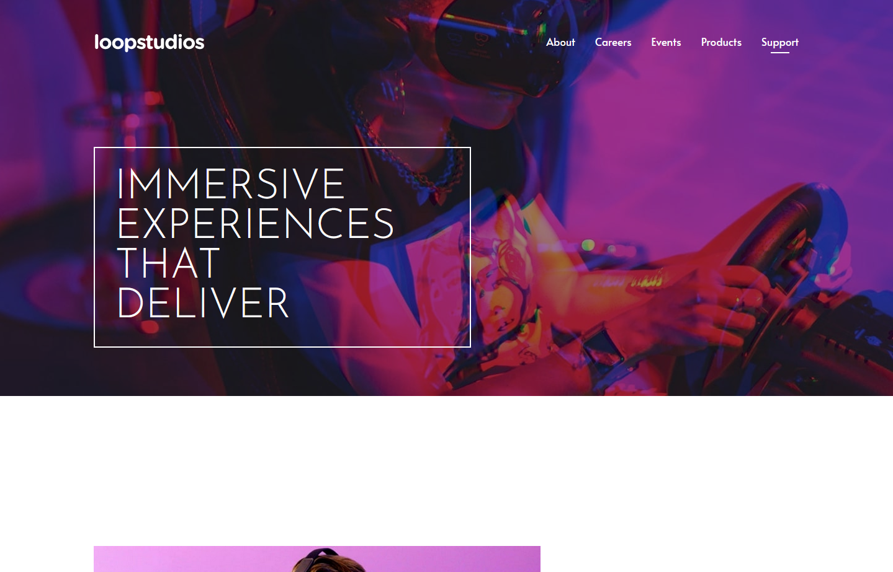

# LoopStudios landing page

## Overview

### About the project

A fully responsive landing page using the mobile-first approach, created with the intent to use:

- Toggle Navigation Menu
- CSS Grid-Layout
- Pseudo-classes usage
- Positioning properties
- Hover states creation with pseudo-classes

### Users should be able to:

- View the optimal layout for the site depending on their device's screen size
- See hover states for all interactive elements on the page

### Links:

- Live Site: [Loopstudio Landing Page](https://app.netlify.com/sites/loopstpage/overview)

Template design made by: [Frontend Mentor - Loopstudios Landing Page](https://www.frontendmentor.io/challenges/loopstudios-landing-page-N88J5Onjw)

 

## Screenshots

  
  
  

## Continued development

I am currently learning about accessibility and SEO, which I intend to put into practice in future projects. As I evolve, I'm always looking to improve my semantics to avoid repetition and redundancy, making clean, easy-to-read code

## Author

- LinkedIn - [Italo Guimarães](https://www.linkedin.com/in/italo-guimaraes13/)
- Frontend Mentor - [@itsguim](https://www.frontendmentor.io/profile/itsguim)
